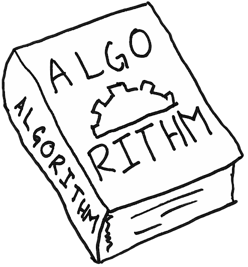

# Algo-python

## Introduction
These are algorithms that are asked in job interviews 
### Installation
<table>
      <tr>
            <code>git clone https://github.com/PRkudupu/Algo-python.git                                                                  </code>
      </tr>
       
      <tr>
          <code>cd Algo-python</code> 
      </tr>
</table>

### License 
Algo-python is released under the MIT license:
 <a href="https://opensource.org/licenses/MIT">opensource.org/licenses/MIT</a>.

